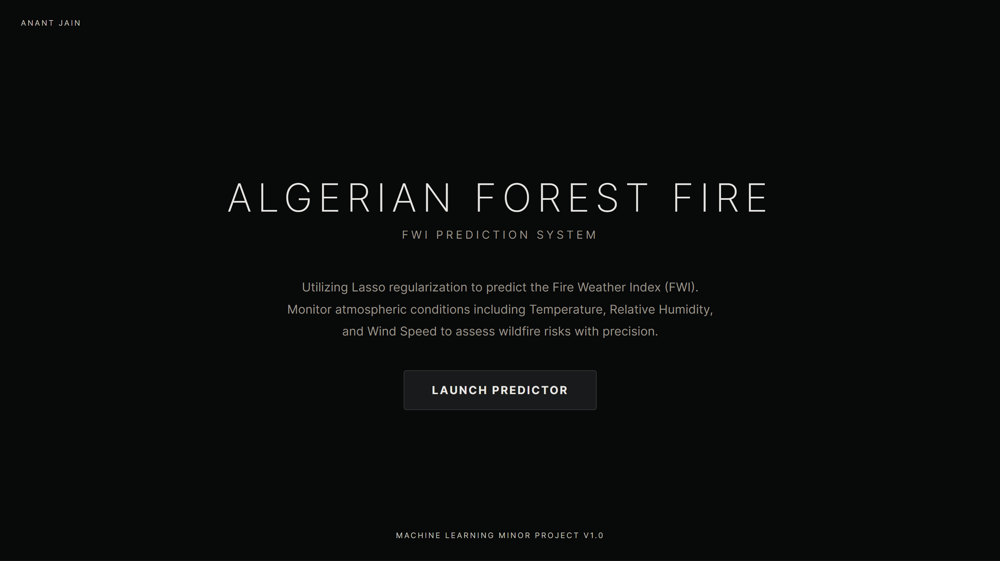
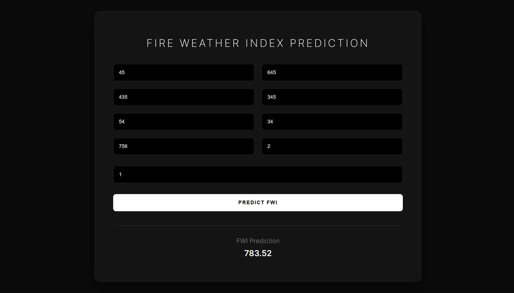

# 🔥 Algerian Forest Fire: FWI Prediction System

A machine learning solution designed to predict the **Fire Weather Index (FWI)**, a critical component of the Canadian Forest Fire Weather Index System. By analyzing atmospheric conditions, this system enables proactive wildfire risk assessment and environmental monitoring.

## 🚀 Live Demo
[**Click here to view the live app on Render**](https://fwi-prediction-system.onrender.com)
<table sorted>
  <tr>
    <td align="center">
      
    </td>
    <td align="center">
      
    </td>
  </tr>
</table>

## 📌 Project Overview
The project utilizes environmental data from the Bejaia and Sidi Bel-Abbes regions of Algeria. The goal is to shift from reactive fire monitoring to predictive risk management using atmospheric parameters.

### 💡 Key Features:
1. **Lasso Regularization:** Employs Lasso (L1) regression to prevent overfitting and perform automated feature selection, ensuring high model interpretability.
2. **Real-time Inference:** A Flask-based web interface where users can input parameters like Temperature, Humidity, and Wind Speed to get instant FWI scores.
3. **Clean Architecture:** Separated concern between the research phase (Jupyter Notebooks) and the production phase (Flask Application).

## 🛠️ Tech Stack
- **Machine Learning:** Scikit-Learn (Lasso, Ridge, Linear Regression)
- **Deployment:** Flask, Render, Gunicorn
- **Data Stack:** Pandas, NumPy, Matplotlib, Seaborn
- **Frontend:** HTML5, CSS3 (Modern Dark UI)

## 📊 Results & Insights
- **Core Technique:** Lasso Regression (L1 Regularization)
- **Key Metric:** The Lasso model was selected for production due to its robust performance and ability to handle multi-collinearity among atmospheric features.
- **Validation:** Visualized through residual plots and R² scoring to ensure reliable predictions across varying weather conditions.


## 📂 Project Structure
```text
├── application.py                                # Flask Server Entry Point
├── models/
│   ├── lasso.pkl                                 # Best performing Lasso model
│   ├── ridge.pkl                                 # Ridge regression model
│   └── scaler.pkl                                # StandardScaler for feature normalization
├── templates/
│   ├── index.html                                # Landing Page (Hero Section)
│   └── home.html                                 # Prediction Form & Result UI
├── notebooks/
│   ├── ridgelasso.ipynb                          # Model Training & EDA Notebook
│   └── Algerian_forest_fires_dataset_UPDATE.csv  # Cleaned Dataset
└── requirements.txt        # Python Dependencies

```

## ⚙️ Installation & Local Setup

1. **Clone the repository:**
   ```bash
   git clone [https://github.com/anantj09/Algerian-Forest-Fire-Prediction.git](https://github.com/anantj09/Algerian-Forest-Fire-Prediction.git)
   cd Algerian-Forest-Fire-Prediction
   ```
2. **Create a virtual environment:**
   ```bash
   python -m venv venv
   # On Windows:
   .\venv\Scripts\activate
   # On macOS/Linux:
   source venv/bin/activate
   ```
3. **Install dependencies:**
   ```bash
   pip install -r requirements.txt
   ```
4. **Run the application:**
   ```bash
   python application.py
   ```

## 📝 Author - **Anant Jain**

[](https://www.linkedin.com/in/anant-jain09/)
[](https://github.com/anantj09)

---

> **Note:** This project focuses on the practical application of Regularization techniques in environmental data science, providing a robust tool for wildfire risk assessment.
